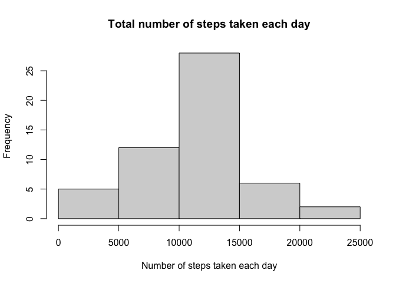
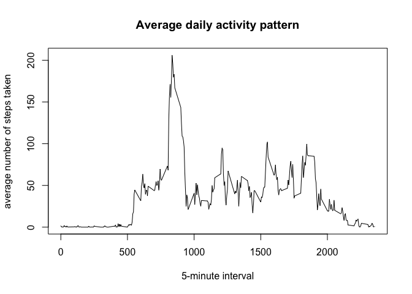
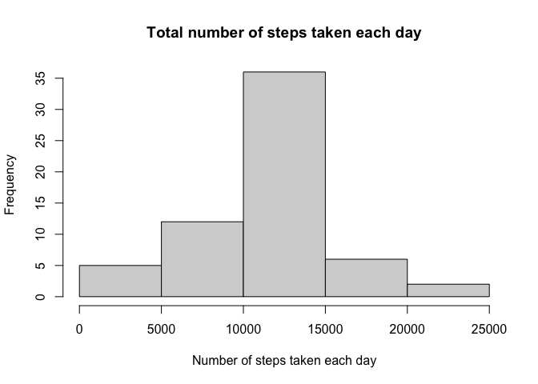
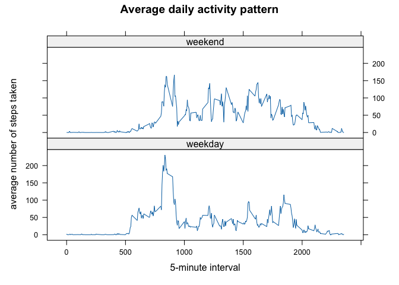

## Loading and preprocessing the data


```r
# Unzip activity.zip if not already done
if (!file.exists("activity.csv")) {
  unzip("activity.zip")
}
# Read the data on page 1
df <- read.csv("activity.csv")

# Take a look at the data
str(df)
```

```
## 'data.frame':	17568 obs. of  3 variables:
##  $ steps   : int  NA NA NA NA NA NA NA NA NA NA ...
##  $ date    : chr  "2012-10-01" "2012-10-01" "2012-10-01" "2012-10-01" ...
##  $ interval: int  0 5 10 15 20 25 30 35 40 45 ...
```

## What is mean total number of steps taken per day?


```r
# Calculate the mean total number of steps taken per day
steps_per_day <- aggregate(steps ~ date, df, sum)
# Make a histogram of the total number of steps taken each day
hist(steps_per_day$steps, 
  main = "Total number of steps taken each day", 
  xlab = "Number of steps taken each day", 
  ylab = "Frequency")
```

<!-- -->


```r
# Calculate and report the mean and median of the total number of steps taken per day
mean_steps_per_day <- mean(steps_per_day$steps)
median_steps_per_day <- median(steps_per_day$steps)
print(mean_steps_per_day)
```

```
## [1] 10766.19
```

```r
print(median_steps_per_day)
```

```
## [1] 10765
```

## What is the average daily activity pattern?


```r
# Make a time series plot (i.e. type = "l"type = "l") of the 
# 5-minute interval (x-axis) and the average number of steps taken, 
# averaged across all days (y-axis)

average_steps_per_interval <- aggregate(steps ~ interval, df, mean)
# Times series plot using plot
plot(average_steps_per_interval$interval, 
  average_steps_per_interval$steps, 
  type = "l",
   xlab = "5-minute interval", 
   ylab = "average number of steps taken", 
   main = "Average daily activity pattern")
```

<!-- -->


## Imputing missing values

```r
# Calculate and report the total number of missing values in the dataset 
# (i.e. the total number of rows with NANAs)
missing_values <- sum(is.na(df$steps))
print(missing_values)
```

```
## [1] 2304
```


```r
# Devise a strategy for filling in all of the missing values in the dataset. 
# The strategy does not need to be sophisticated. 
# For example, you could use the mean/median for that day, or the mean for that 5-minute interval, etc.

# Create a new dataset that is equal to the original dataset but with the missing data filled in.
# Fill in missing values with the mean for that 5-minute interval
df_imputed <- df
for (i in 1:nrow(df_imputed)) { # for each row
  if (is.na(df_imputed$steps[i])) { # if the steps value is missing
    interval <- df_imputed$interval[i] # get the interval
    steps <- average_steps_per_interval$steps[average_steps_per_interval$interval == interval] # get the mean steps for that interval
    df_imputed$steps[i] <- steps # replace the missing steps value with the mean for that interval
  }
}
```


```r
# Make a histogram of the total number of steps taken each day and
# Calculate and report the mean and median total number of steps taken per day.
steps_per_day_imputed <- aggregate(steps ~ date, df_imputed, sum)
hist(steps_per_day_imputed$steps, 
  main = "Total number of steps taken each day", 
  xlab = "Number of steps taken each day", 
  ylab = "Frequency")
```

<!-- -->

Now we can calculate the mean and median of the total number of steps taken per day after the missing values are imputed.

```r
# Calculate and report the mean and median of the total number of steps taken per day
mean_steps_per_day_imputed <- mean(steps_per_day_imputed$steps)
median_steps_per_day_imputed <- median(steps_per_day_imputed$steps)
print(mean_steps_per_day_imputed)
```

```
## [1] 10766.19
```

```r
print(median_steps_per_day_imputed)
```

```
## [1] 10766.19
```
Based on the results, there is no difference in the mean and median of the total number of steps taken per day before and after the missing values are imputed.

## Are there differences in activity patterns between weekdays and weekends?

```r
# Create a new factor variable in the dataset with two levels - "weekday" and "weekend"
# indicating whether a given date is a weekday or weekend day.
df_imputed$date <- as.Date(df_imputed$date)
df_imputed$day <- weekdays(df_imputed$date)
df_imputed$day_type <- ifelse(df_imputed$day %in% c("Saturday", "Sunday"), "weekend", "weekday")
df_imputed$day_type <- as.factor(df_imputed$day_type)
```


```r
# Make a panel plot containing a time series plot (i.e. type = "l") 
# of the 5-minute interval (x-axis) and the average number of steps taken,
# averaged across all weekday days or weekend days (y-axis).
average_steps_per_interval_imputed <- aggregate(steps ~ interval + day_type, df_imputed, mean)
library(lattice)
xyplot(steps ~ interval | day_type, 
  data = average_steps_per_interval_imputed, 
  layout = c(1, 2), 
  type = "l",
  xlab = "5-minute interval", 
  ylab = "average number of steps taken", 
  main = "Average daily activity pattern")
```

<!-- -->
